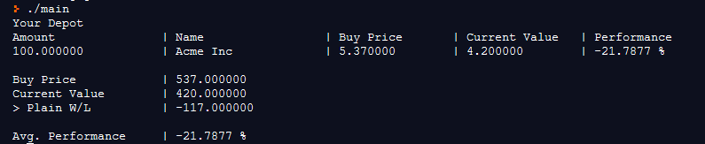

# CLI Depot

This project is intended to help you testing your financial strategies.
CLI-Depot lets you create a plain txt file containing all the positions you've got (or would have invested in) and calculates the W/L and performance of each and all positions.

## Showcase


## Build from source
Since the application is written in C++ with minimal library dependency you simply need to run
```sh
$ gcc main.cpp
```
and the depot should be available to you as binary.

## Sample Depot file
Create a file called `depot.txt` in the folder where the binary is contained with following content.
```
1 AcmeInc 20 25
```
```
1 -> Amount
AcmeInc -> Company
20 -> Buy Price
25 -> Current Value
```